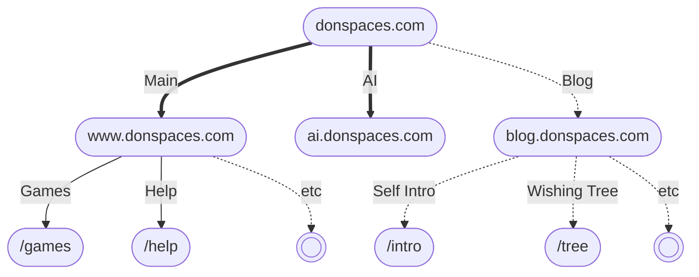
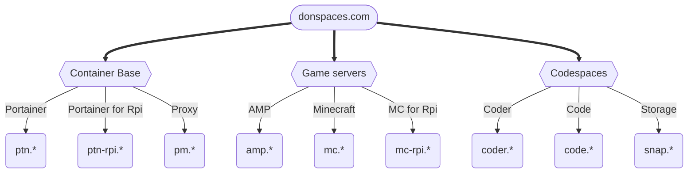

# Website map (future)

Here is a map of the major website structure on domain ```*.donspaces.com```:



Here is a map of websites that served for other functions on domain ```*.donspaces.com``` 
(***mostly private, operated by site manager***):


> Except all these websites, there will be many more interesting features that will be 
> integrated to our domain. 
> For more information, please contact us through our 
> [email](https://www.donspaces.com/welcome.html#contact-us).
>
{style="note"}
